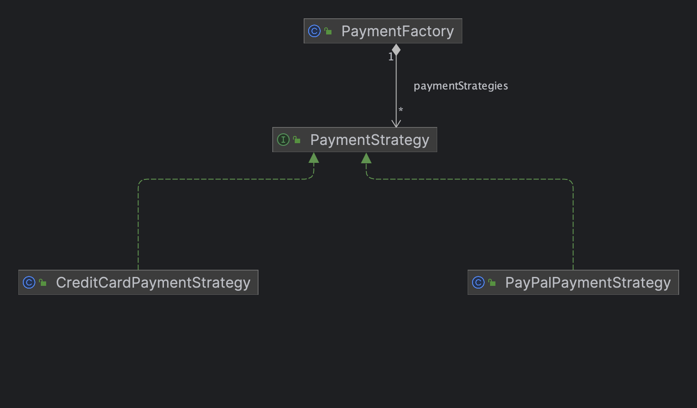

# Payment Method Implementation Project

## Summary

This project demonstrates the implementation of a payment system using the Strategy Design Pattern. The Strategy Design Pattern is a behavioral design pattern that allows you to define a family of algorithms, encapsulate each one of them, and make them interchangeable. In the context of our project, it allows us to define multiple payment strategies and choose the appropriate one at runtime without altering the client code.





## Design Patterns Implemented

## Strategy Design Pattern

The Strategy Design Pattern is at the heart of our payment system implementation. It allows us to define different payment strategies (e.g., PayPal, Credit Card) as separate classes that implement a common interface. This approach promotes flexibility and extensibility, as new payment methods can be added without modifying existing code. Each payment strategy encapsulates its payment logic, making it easy to switch between payment methods dynamically.

## Implementation

## PaymentStrategy Interface

We have defined a PaymentStrategy interface, which serves as the contract for all payment strategy implementations. It declares a single method, pay(BigDecimal amount), that takes the payment amount as input and returns a Receipt object representing the payment transaction. This interface ensures that all payment strategies have a consistent interface.

## Concrete Payment Strategies

We have implemented concrete payment strategies as separate classes, each representing a specific payment method. For example, the CreditCardPaymentStrategy and PayPalPaymentStrategy classes implement the PaymentStrategy interface and encapsulate the payment logic for credit card and PayPal payments, respectively.

## PaymentFactory

To dynamically select and execute payment strategies, we have created a PaymentFactory class. This class uses a map to store different payment strategies, and based on the payment method selected, it retrieves the appropriate strategy and executes the payment. This approach allows us to switch between payment methods without modifying client code.

## PaymentFactoryTest

We have also provided a set of JUnit tests in the PaymentFactoryTest class to ensure the correctness of our payment system implementation. These tests cover scenarios such as successful payments with PayPal and credit cards, as well as handling unsupported and unknown payment methods.

## Usage

To use this payment system in your own application, follow these steps:


Define the payment strategies you need by implementing the PaymentStrategy interface for each method you want to support (e.g., PayPal, Credit Card).


Configure the PaymentFactory with the implemented payment strategies and annotate it with @Component.


Use the PaymentFactory to initiate payments by providing the payment method and amount.


Ensure that you handle exceptions when using unsupported or unknown payment methods.

``` java
// Inject paymentFactory.
@Autowired
PaymentFactory paymentFactory;

// Proceed with a payment using a specific method and amount.
PaymentMethodEnum paymentMethod = PaymentMethodEnum.PAYPAL;
BigDecimal amount = new BigDecimal(100);
Receipt receipt = paymentFactory.proceedPayment(paymentMethod.label, amount);

// Handle the receipt and process the payment response as needed.
```